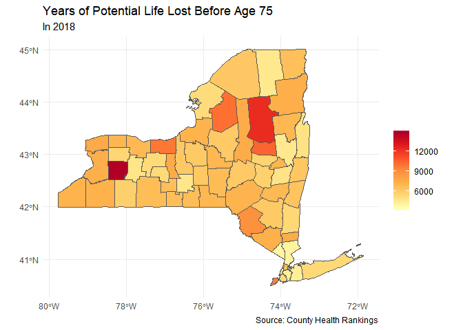

map practice
================
Gabriel Kahn
May 21, 2019

Exploring Health Outcomes in America's States
=============================================

In 2018, County Health Records released a dataset reporting on the health of each of America's counties. By merging their extensive dataset with the geographic information contained in the census, we will get a better picture of how our country varies according to their health and quality of life.

Ohio
----

``` r
ggmap(ohio_stamen) 
```


### Median Household Income

We will begin our analysis of Ohio by looking at the median income by county. My initial prediction is that counties with lower median incomes will have more negative health measures


``` r
together %>% 
  filter(estimate <= 42000) %>% 

ggplot() +
  # use fill and color to avoid gray boundary lines
  geom_sf(aes(fill = estimate)) +
  # increase interpretability of graph
   geom_sf_text(aes(label = Name), size = 3, color= "red")+
  scale_fill_continuous(labels = scales::dollar, type = "viridis") +
  
  labs(title = "Median household income in Ohio",
       subtitle = "Below $42,000",
       color = NULL,
       fill = NULL,
       caption = "Source: American Community Survey")
```

    ## Warning in st_point_on_surface.sfc(sf::st_zm(x)): st_point_on_surface may
    ## not give correct results for longitude/latitude data


### Adult Smoking Rates

Each year approximately 480,000 premature deaths can be attributed to smoking. Cigarette smoking is identified as a cause of various cancers, cardiovascular disease, and respiratory conditions, as well as low birthweight and other adverse health outcomes. Measuring the prevalence of tobacco use in the population can alert communities to potential adverse health outcomes and can be valuable for assessing the need for cessation programs or the effectiveness of existing programs.

``` r
ggplot(data = together) +
  geom_sf(aes(fill = Adult.smoking.raw.value)) +
  scale_fill_gradientn(colors = brewer.pal(7, "YlOrRd")) +
  labs(title = "Adult Smoking Rates in Ohio",
       subtitle = "In 2016",
       color = NULL,
       fill = NULL,
       caption = "Source: County Health Rankings")
```


Looking at the above chart, we see that smoking rates greatly vary across Ohio from under 10% to above a quarter of the population.

``` r
together %>% 
  filter(Adult.smoking.raw.value >= .25) %>% 
ggplot() +
  geom_sf(aes(fill = Adult.smoking.raw.value)) +
  
  geom_sf_text(aes(label = Name), size = 3)+
  scale_fill_gradientn(colors = brewer.pal(7, "YlOrRd")) +
  labs(title = "Adult Smoking Rates in Ohio",
       subtitle = "Above 25%",
       color = NULL,
       fill = NULL,
       caption = "Source: County Health Rankings")
```

    ## Warning in st_point_on_surface.sfc(sf::st_zm(x)): st_point_on_surface may
    ## not give correct results for longitude/latitude data


When we filter the data to isolate counties with smoking rates of above 25%, we see that several of these counties were also low income.

### Rates of Uninsured

Even with the passage of Obamacare, many in this country still lack access to healthcare. This puts millions of people at risk if and when they need access to medical services.

``` r
ggplot(data = together) +
  geom_sf(aes(fill = Uninsured.raw.value)) +
  scale_fill_gradientn(colors = brewer.pal(7, "YlOrRd")) +
    labs(title = "Rates of Uninsured in Ohio",
       subtitle = "In 2018",
       color = NULL,
       fill = NULL,
       caption = "Source: County Health Rankings")
```


This chart tells us that there is geographic inequality when it comes to health coverage. While it appears that most of the state has high rates of coverage, several counties stand out as having very low rates of coverage.

``` r
together %>% 
  filter(Uninsured.raw.value >= .2) %>% 

ggplot() +
  geom_sf(aes(fill = Uninsured.raw.value)) +
  geom_sf_text(aes(label = Name), size = 3) +
  scale_fill_gradientn(colors = brewer.pal(7, "YlOrRd")) +
  labs(title = "Rates of Uninsured in Ohio",
       subtitle = "Above 20%",
       color = NULL,
       fill = NULL,
       caption = "Source: County Health Rankings")
```

    ## Warning in st_point_on_surface.sfc(sf::st_zm(x)): st_point_on_surface may
    ## not give correct results for longitude/latitude data


From the graph, it appears that several counties along the bottom half of the state have high rates of uninsured citizens.

### Years of Potential Life Lost Before 75

Years of Potential Life Lost (YPLL) is a measure of the rate and distribution of premature mortality. Measuring premature mortality, rather than overall mortality, focuses attention on deaths that could have been prevented. YPLL emphasizes deaths of younger persons, whereas statistics that include all mortality are dominated by deaths of the elderly. For example, using YPLL-75, a death at age 55 counts twice as much as a death at age 65, and a death at age 35 counts eight times as much as a death at age 70. Rates are measured by years of life lost before age 75 per 100,000 population.

``` r
ggplot(data = together) +
  geom_sf(aes(fill = Premature.death.raw.value)) +
  scale_fill_gradientn(colors = brewer.pal(7, "YlOrRd")) +
    labs(title = "Years of Potential Life Lost Before Age 75",
       subtitle = "In 2018",
       color = NULL,
       fill = NULL,
       caption = "Source: County Health Rankings")
```


``` r
together %>% 
  filter(Premature.death.raw.value >= 15000) %>% 

ggplot() +
  geom_sf(aes(fill = Premature.death.raw.value)) +
  geom_sf_text(aes(label = Name), size = 3) +
  scale_fill_gradientn(colors = brewer.pal(7, "YlOrRd")) +
  labs(title = "Years of Potential Life Lost Before Age 75",
       subtitle = "Above 15,000",
       color = NULL,
       fill = NULL,
       caption = "Source: County Health Rankings")
```

    ## Warning in st_point_on_surface.sfc(sf::st_zm(x)): st_point_on_surface may
    ## not give correct results for longitude/latitude data


New York
--------

New York is an interesting state for analysis due to the split between the lower counties and those upstate. In this analysis we keep this dichotomy in mind, as well as compare the results to those from Ohio counties.

### Median Household Income

``` r
ggplot(data = NY_inc) +
  # use fill and color to avoid gray boundary lines
  geom_sf(aes(fill = estimate)) +
  # increase interpretability of graph
  scale_fill_continuous(labels = scales::dollar, type = "viridis") +
  
  labs(title = "Median household income in NY",
       subtitle = "In 2017",
       color = NULL,
       fill = NULL,
       caption = "Source: American Community Survey")
```


Looking at the above graph, we see that higher incomes are concentrated towards New York City, while median income for counties upstate fall significantly short.

The distribution seems similar to Ohio in that there are a few counties with high median income and much more with lower values.

``` r
togetherNY %>% 
  filter(estimate <= 47000) %>% 

ggplot() +
  # use fill and color to avoid gray boundary lines
  geom_sf(aes(fill = estimate)) +
   geom_sf_text(aes(label = Name, color = "red"), size = 3)+
  # increase interpretability of graph
  scale_fill_continuous(labels = scales::dollar, type = "viridis") +
  
  labs(title = "Median household income in NY",
       subtitle = "Below $47,000",
       color = NULL,
       fill = NULL,
       caption = "Source: American Community Survey")
```

    ## Warning in st_point_on_surface.sfc(sf::st_zm(x)): st_point_on_surface may
    ## not give correct results for longitude/latitude data


When we filter for low-income counties, we see several things. One, there are fewer low-income counties in New York than there are in Ohio. The threshold used to filter the data in New York is 47,000, while in Ohio it is 42,000.

Also, we see that Bronx County has the lowest median income by a sizable margin and that there is a cluster of low income counties in New York's Southern Tier region which borders Pennslyvania.

### Adult Smoking Rates

Each year approximately 480,000 premature deaths can be attributed to smoking. Cigarette smoking is identified as a cause of various cancers, cardiovascular disease, and respiratory conditions, as well as low birthweight and other adverse health outcomes. Measuring the prevalence of tobacco use in the population can alert communities to potential adverse health outcomes and can be valuable for assessing the need for cessation programs or the effectiveness of existing programs.

``` r
ggplot(data = togetherNY) +
  geom_sf(aes(fill = Adult.smoking.raw.value)) +
  scale_fill_gradientn(colors = brewer.pal(7, "YlOrRd")) +
  labs(title = "Adult Smoking Rates in NY",
       subtitle = "In 2016",
       color = NULL,
       fill = NULL,
       caption = "Source: County Health Rankings")
```


New York generally has a lower smoking rate than Ohio, which rises as we move north and west.

``` r
togetherNY %>% 
  filter(Adult.smoking.raw.value >= .25) %>% 
ggplot() +
  geom_sf(aes(fill = Adult.smoking.raw.value)) +
  
  geom_sf_text(aes(label = Name), size = 3)+
  scale_fill_gradientn(colors = brewer.pal(7, "YlOrRd")) +
  labs(title = "Adult Smoking Rates in NY",
       subtitle = "Above 25%",
       color = NULL,
       fill = NULL,
       caption = "Source: County Health Rankings")
```

    ## Warning in st_point_on_surface.sfc(sf::st_zm(x)): st_point_on_surface may
    ## not give correct results for longitude/latitude data


These four counties have similar smoking rates and the are all located in Western NY.

### Rates of Uninsured

Even with the passage of Obamacare, many in this country still lack access to healthcare. This puts millions of people at risk if and when they need access to medical services.

``` r
ggplot(data = togetherNY) +
  geom_sf(aes(fill = Uninsured.raw.value)) +
  scale_fill_gradientn(colors = brewer.pal(7, "YlOrRd")) +
    labs(title = "Rates of Uninsured in NY",
       subtitle = "In 2018",
       color = NULL,
       fill = NULL,
       caption = "Source: County Health Rankings")
```


This chart tells us that there is geographic inequality when it comes to health coverage. While it appears that most of the state has high rates of coverage, several counties stand out as having very low rates of coverage.

``` r
togetherNY %>% 
  filter(Uninsured.raw.value >= .2) %>% 

ggplot() +
  geom_sf(aes(fill = Uninsured.raw.value)) +
  geom_sf_text(aes(label = Name), size = 3) +
  scale_fill_gradientn(colors = brewer.pal(7, "YlOrRd")) +
  labs(title = "Rates of Uninsured in NY",
       subtitle = "Above 20%",
       color = NULL,
       fill = NULL,
       caption = "Source: County Health Rankings")
```

    ## Warning in st_point_on_surface.sfc(sf::st_zm(x)): st_point_on_surface may
    ## not give correct results for longitude/latitude data


From the graph, it appears that several counties along the bottom half of the state have high rates of uninsured citizens.

### Years of Potential Life Lost Before Age 75

``` r
ggplot(data = togetherNY) +
  geom_sf(aes(fill = Premature.death.raw.value)) +
  scale_fill_gradientn(colors = brewer.pal(7, "YlOrRd")) +
    labs(title = "Years of Potential Life Lost Before Age 75",
       subtitle = "In 2018",
       color = NULL,
       fill = NULL,
       caption = "Source: County Health Rankings")
```


Years of Potential Life Lost (YPLL) is a measure of the rate and distribution of premature mortality. Measuring premature mortality, rather than overall mortality, focuses attention on deaths that could have been prevented. YPLL emphasizes deaths of younger persons, whereas statistics that include all mortality are dominated by deaths of the elderly. For example, using YPLL-75, a death at age 55 counts twice as much as a death at age 65, and a death at age 35 counts eight times as much as a death at age 70. Rates are measured by years of life lost before age 75 per 100,000 population.

``` r
togetherNY %>% 
  filter(Premature.death.raw.value >= 14000) %>% 

ggplot() +
  geom_sf(aes(fill = Premature.death.raw.value)) +
  geom_sf_text(aes(label = Name), size = 3) +
  scale_fill_gradientn(colors = brewer.pal(7, "YlOrRd")) +
  labs(title = "Years of Potential Life Lost Before Age 75",
       subtitle = "Above 14,000",
       color = NULL,
       fill = NULL,
       caption = "Source: County Health Rankings")
```

    ## Warning in st_point_on_surface.sfc(sf::st_zm(x)): st_point_on_surface may
    ## not give correct results for longitude/latitude data


