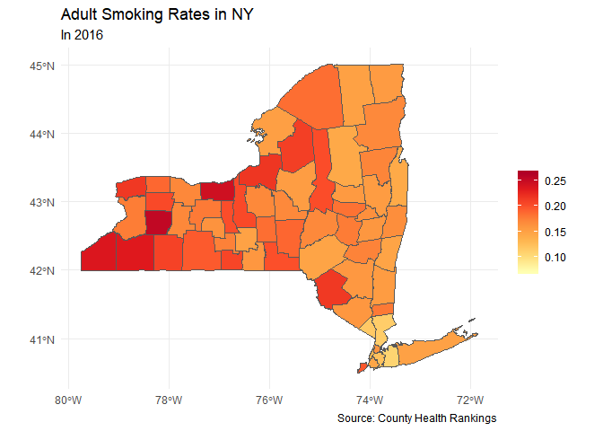

County Health Data Analysis
================
Gabriel Kahn
May 21, 2019

Exploring Health Outcomes in America's States
=============================================

In 2018, County Health Records released a dataset reporting on the health of each of America's counties. By merging their extensive dataset with the geographic information contained in the census, we will get a better picture of how our country varies according to their health and quality of life.

Ohio
----

    ## Source : http://tile.stamen.com/terrain/8/67/94.png

    ## Source : http://tile.stamen.com/terrain/8/68/94.png

    ## Source : http://tile.stamen.com/terrain/8/69/94.png

    ## Source : http://tile.stamen.com/terrain/8/70/94.png

    ## Source : http://tile.stamen.com/terrain/8/67/95.png

    ## Source : http://tile.stamen.com/terrain/8/68/95.png

    ## Source : http://tile.stamen.com/terrain/8/69/95.png

    ## Source : http://tile.stamen.com/terrain/8/70/95.png

    ## Source : http://tile.stamen.com/terrain/8/67/96.png

    ## Source : http://tile.stamen.com/terrain/8/68/96.png

    ## Source : http://tile.stamen.com/terrain/8/69/96.png

    ## Source : http://tile.stamen.com/terrain/8/70/96.png

    ## Source : http://tile.stamen.com/terrain/8/67/97.png

    ## Source : http://tile.stamen.com/terrain/8/68/97.png

    ## Source : http://tile.stamen.com/terrain/8/69/97.png

    ## Source : http://tile.stamen.com/terrain/8/70/97.png

    ## Source : http://tile.stamen.com/terrain/8/67/98.png

    ## Source : http://tile.stamen.com/terrain/8/68/98.png

    ## Source : http://tile.stamen.com/terrain/8/69/98.png

    ## Source : http://tile.stamen.com/terrain/8/70/98.png

    ## 939x793 terrain map image from Stamen Maps. 
    ## See ?ggmap to plot it.

``` r
ggmap(ohio_stamen) 
```


### Median Household Income

We will begin our analysis of Ohio by looking at the median income by county. My initial prediction is that counties with lower median incomes will have more negative health measures


Looking at the chart above, we see that other than central Ohio, where the city of Columbus is located, much of the state has relatively low median income. This makes sense when one understands the deindustrialization which took place following the 1980's, which hurt many local economies.

    ## Warning in st_point_on_surface.sfc(sf::st_zm(x)): st_point_on_surface may
    ## not give correct results for longitude/latitude data


Many of the low income counties are located on the southern tip of Ohio. Further research will be interested in seeing if this trend bleeds over into neighboring Kentucky or if the trend is isolated in Ohio. This could signal whether or not state policies may be responsible for the low income or if it is simply a feature of the greater region.

### Adult Smoking Rates

Each year approximately 480,000 premature deaths can be attributed to smoking. Cigarette smoking is identified as a cause of various cancers, cardiovascular disease, and respiratory conditions, as well as low birthweight and other adverse health outcomes. Measuring the prevalence of tobacco use in the population can alert communities to potential adverse health outcomes and can be valuable for assessing the need for cessation programs or the effectiveness of existing programs.


Looking at the above chart, we see that smoking rates greatly vary across Ohio from under 10% to above a quarter of the population.

    ## Warning in st_point_on_surface.sfc(sf::st_zm(x)): st_point_on_surface may
    ## not give correct results for longitude/latitude data


When we filter the data to isolate counties with smoking rates of above 25%, we see that several of these counties were also low income.

### Rates of Uninsured

Even with the passage of Obamacare, many in this country still lack access to healthcare. This puts millions of people at risk if and when they need access to medical services.


This chart tells us that there is geographic inequality when it comes to health coverage. While it appears that most of the state has high rates of coverage, several counties stand out as having very low rates of coverage.

    ## Warning in st_point_on_surface.sfc(sf::st_zm(x)): st_point_on_surface may
    ## not give correct results for longitude/latitude data


From the graph, it appears that several counties along the bottom half of the state have high rates of uninsured citizens.

### Years of Potential Life Lost Before 75

Years of Potential Life Lost (YPLL) is a measure of the rate and distribution of premature mortality. Measuring premature mortality, rather than overall mortality, focuses attention on deaths that could have been prevented. YPLL emphasizes deaths of younger persons, whereas statistics that include all mortality are dominated by deaths of the elderly. For example, using YPLL-75, a death at age 55 counts twice as much as a death at age 65, and a death at age 35 counts eight times as much as a death at age 70. Rates are measured by years of life lost before age 75 per 100,000 population.


    ## Warning in st_point_on_surface.sfc(sf::st_zm(x)): st_point_on_surface may
    ## not give correct results for longitude/latitude data


New York
--------

    ## Source : http://tile.stamen.com/terrain/8/71/92.png

    ## Source : http://tile.stamen.com/terrain/8/72/92.png

    ## Source : http://tile.stamen.com/terrain/8/73/92.png

    ## Source : http://tile.stamen.com/terrain/8/74/92.png

    ## Source : http://tile.stamen.com/terrain/8/75/92.png

    ## Source : http://tile.stamen.com/terrain/8/76/92.png

    ## Source : http://tile.stamen.com/terrain/8/71/93.png

    ## Source : http://tile.stamen.com/terrain/8/72/93.png

    ## Source : http://tile.stamen.com/terrain/8/73/93.png

    ## Source : http://tile.stamen.com/terrain/8/74/93.png

    ## Source : http://tile.stamen.com/terrain/8/75/93.png

    ## Source : http://tile.stamen.com/terrain/8/76/93.png

    ## Source : http://tile.stamen.com/terrain/8/71/94.png

    ## Source : http://tile.stamen.com/terrain/8/72/94.png

    ## Source : http://tile.stamen.com/terrain/8/73/94.png

    ## Source : http://tile.stamen.com/terrain/8/74/94.png

    ## Source : http://tile.stamen.com/terrain/8/75/94.png

    ## Source : http://tile.stamen.com/terrain/8/76/94.png

    ## Source : http://tile.stamen.com/terrain/8/71/95.png

    ## Source : http://tile.stamen.com/terrain/8/72/95.png

    ## Source : http://tile.stamen.com/terrain/8/73/95.png

    ## Source : http://tile.stamen.com/terrain/8/74/95.png

    ## Source : http://tile.stamen.com/terrain/8/75/95.png

    ## Source : http://tile.stamen.com/terrain/8/76/95.png

    ## Source : http://tile.stamen.com/terrain/8/71/96.png

    ## Source : http://tile.stamen.com/terrain/8/72/96.png

    ## Source : http://tile.stamen.com/terrain/8/73/96.png

    ## Source : http://tile.stamen.com/terrain/8/74/96.png

    ## Source : http://tile.stamen.com/terrain/8/75/96.png

    ## Source : http://tile.stamen.com/terrain/8/76/96.png

    ## 1112x1477 terrain map image from Stamen Maps. 
    ## See ?ggmap to plot it.


New York is an interesting state for analysis due to the split between the lower counties and those upstate. In this analysis we keep this dichotomy in mind, as well as compare the results to those from Ohio counties.

### Median Household Income


Looking at the above graph, we see that higher incomes are concentrated towards New York City, while median income for counties upstate fall significantly short.

The distribution seems similar to Ohio in that there are a few counties with high median income and much more with lower values.

    ## Warning in st_point_on_surface.sfc(sf::st_zm(x)): st_point_on_surface may
    ## not give correct results for longitude/latitude data


When we filter for low-income counties, we see several things. One, there are fewer low-income counties in New York than there are in Ohio. The threshold used to filter the data in New York is 47,000, while in Ohio it is 42,000.

Also, we see that Bronx County has the lowest median income by a sizable margin and that there is a cluster of low income counties in New York's Southern Tier region which borders Pennslyvania.

### Adult Smoking Rates

Each year approximately 480,000 premature deaths can be attributed to smoking. Cigarette smoking is identified as a cause of various cancers, cardiovascular disease, and respiratory conditions, as well as low birthweight and other adverse health outcomes. Measuring the prevalence of tobacco use in the population can alert communities to potential adverse health outcomes and can be valuable for assessing the need for cessation programs or the effectiveness of existing programs.



New York generally has a lower smoking rate than Ohio, which rises as we move north and west.

    ## Warning in st_point_on_surface.sfc(sf::st_zm(x)): st_point_on_surface may
    ## not give correct results for longitude/latitude data


These four counties have similar smoking rates and the are all located in Western NY.

### Rates of Uninsured

We now move onto measuring the rates of uninsured in New York to compare whether or not there is a large difference between states.


This chart tells us that there is geographic inequality when it comes to health coverage. While it appears that most of the state has high rates of coverage, several counties stand out as having very low rates of coverage.

    ## Warning in st_point_on_surface.sfc(sf::st_zm(x)): st_point_on_surface may
    ## not give correct results for longitude/latitude data


From the graph, it appears that several counties along the bottom half of the state have high rates of uninsured citizens.

### Years of Potential Life Lost Before Age 75

We will now move onto analyzing New York's premature death rate.


With this data now available for comparison, it seems that Ohio is undergoing an epidemic of premature deaths as its death rates are higher than New York's in most cases. This visualization helps aid the research of many social scientists who have been looking into the high levels of "death of despair" in the Rust Belt region.

    ## Warning in st_point_on_surface.sfc(sf::st_zm(x)): st_point_on_surface may
    ## not give correct results for longitude/latitude data


Consistent with the rest of the data, Upstate New York has the counties with the highest rates of premature deaths.

Conclusion
==========

Looking at the data from Ohio and New York, it seems that their is great variation in health outcomes in this county, both between states and within them. Cities seem to be healthier in general, even in the case of Bronx county which did not show up in the bottom of health measures despite its low median income. However, we cannot conclude that Bronx County is "healthy" without further analysis of more variables. Overall, New York is healthier than Ohio by what seems to be a large margin, but this should not distract from the fact that there are counties in New York which have troublesome signs.

By mapping data tables geographically, we are better able to visualize the data at hand. From here, we can better see spacial trends, and perhaps by sharing these findings with political policy makers, we can identify regions which need intervention.

Regarding the aesthetic decisions in this assignment, there are several considerations. The red color scale used for the health measures helped allow problematic counties to better stick out, while the smooth color scale eased the large amount of information contained in the graphs. The blue/green color scale used for income data both differentiated it from the health data, and also did a good job in allowing outlying counties to stick out. Seeing how certain clusters of counties share the same color allows the reader to see how data can be spacially correlated. It was also important to keep the color schemes consistent between Ohio and New York for better comparison.

The text label applied to the secondary charts was helpful, but problematic in ways. If I did not use stricter filtering, then there would be too many counties present and the text would overlap more than it already does. As the package used to create this layer is relatively new, there do not seem to be many tools to remedy overlapping text (the position arguments do not get read).

Overall the integration of maps greatly improved the portrayal of data in this case.
